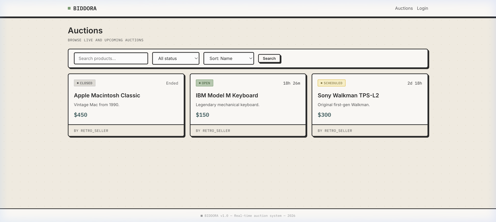
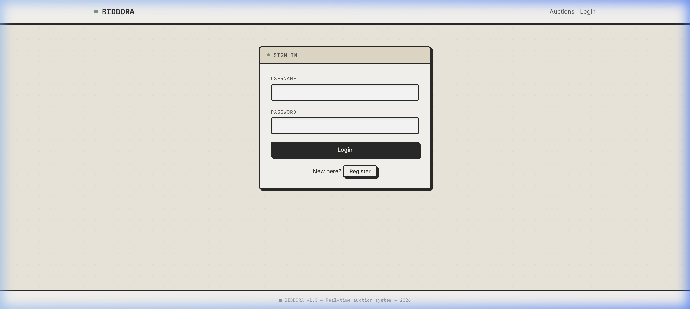
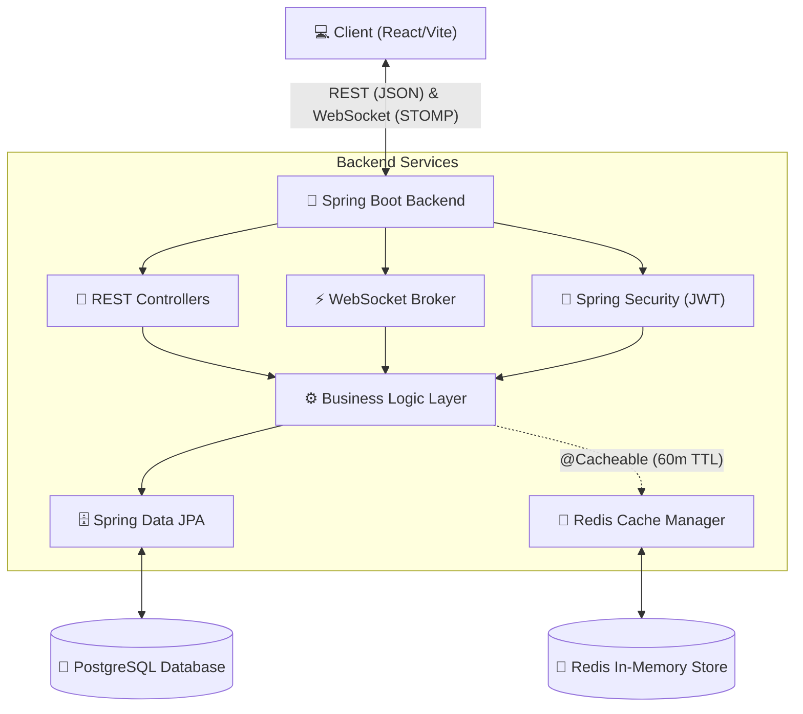

<div align="center">
  
  <h1>Biddora ⚡️</h1>
  <p><strong>A Real-Time, Full-Stack Auction Platform featuring a bold Neo-Brutalist UI</strong></p>
</div>

---

## 📖 Overview

**BidForge** is a comprehensive, production-ready full-stack online auction marketplace. It brings together a beautiful, custom **React frontend** with a robust, highly-concurrent **Spring Boot backend**.

Whether it's vintage electronics or modern art, Biddora allows users to browse active auctions, track time remaining, and engage in **real-time live bidding** powered by WebSockets. The price updates instantly for all connected clients without page reloads.

### ✨ Key Features

- **Live Real-Time Bidding:** Powered by Spring WebSockets and STOMP, bids update instantly across all connected browsers.
- **Bold Neo-Brutalist UI:** A stunning, custom-built React frontend using raw CSS tokens, distinct drop shadows, and sharp borders.
- **Secure Authentication:** Full JWT-based login, registration, and role-based access control (RBAC).
- **Automated Auction Resolution:** Scheduled tasks automatically determine and record auction winners when the clock runs out.
- **User Profiles:** Users can list items, track their won auctions, and manage favorites and reviews.
- **High Performance:** Designed to handle concurrent bids with data consistency checks and optimized PostgreSQL queries.

---

## 🛠️ Technology Stack

### Frontend (Client)
- **React 18** (Vite)
- **Vanilla CSS** (Custom Neo-Brutalist Design System)
- **React Router** for navigation
- **StompJS / SockJS** for WebSocket connections

### Backend (Server)
- **Java 17** & **Spring Boot 3**
- **Spring Security** (JWT Auth)
- **Spring WebSocket** (Live messaging)
- **Spring Data JPA** (Hibernate)

### Database & Infrastructure
- **PostgreSQL** (Relational Data)
- **Docker & Docker Compose** (Containerization)
- **Maven** (Build Tool)

---

## 📸 Interface Previews

| The Marketplace | Secure Authentication |
|:---:|:---:|
|  |  |

*(Note: Biddora features a completely custom CSS framework focusing on contrast, legibility, and physical button presses.)*

---

## 🚀 Running Locally

Biddora is neatly organized into two directories: `/backend` and `/frontend`.

### 1. Start the Database
The backend relies on PostgreSQL. A convenient `docker-compose.yml` is provided in the root directory.
```bash
docker-compose up -d
```

### 2. Start the Backend
Navigate to the backend directory and run the Spring Boot application using the Maven wrapper.
```bash
cd backend
./mvnw spring-boot:run
```
*The backend API will run on `http://localhost:8080`.*

### 3. Start the Frontend
In a new terminal, navigate to the frontend directory, install dependencies, and start the Vite dev server.
```bash
cd frontend
npm install
npm run dev
```
*The UI will run on `http://localhost:5173`.*

---

## 🏗 System Architecture

The following diagram illustrates the high-level architecture of Biddora, highlighting how the React client interacts with the Spring Boot backend via REST and WebSockets, and how the backend manages data persistence and caching.



---

## 🤝 Author
Built by **Akshay Kumar Mishra** 
